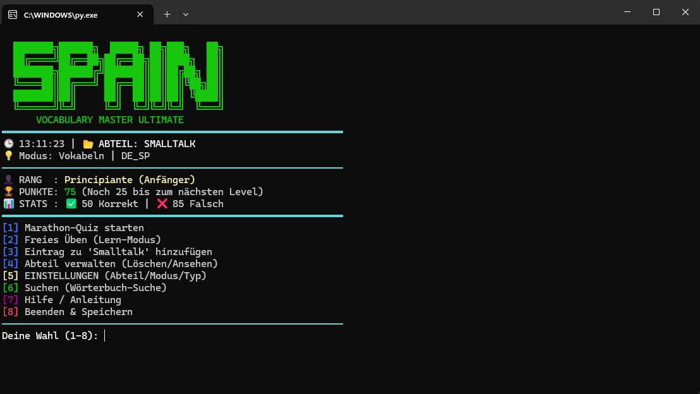

# 🇪🇸 Vocabulary Master Ultimate 2026

Ein hochgradig interaktives CLI-Lernsystem, das speziell für die Vorbereitung auf eine Auswanderung nach Spanien entwickelt wurde. Das Tool kombiniert modernes Python-Engineering mit praktischen Lernmethoden.

## 🚀 Key Features

- **Multi-Abteil-System:** Organisiere dein Lernen in thematische Module wie *Smalltalk*, *Restaurant*, *Natur* oder *Aktion-Verben*.
- **Zwei Lernmodi:** 
    - 🏆 **Marathon-Quiz:** Sammle Punkte, steige im Rang auf und miss deinen Fortschritt mit Live-Statistiken.
    - 📖 **Freies Üben:** Lerne ohne Druck mit integrierter Hilfe-Funktion (`?`).
- **Bidirektionales Training:** Wechsel in den Einstellungen flexibel zwischen *Deutsch ➔ Spanisch* und *Spanisch ➔ Deutsch*.
- **Vokabeln & Sätze:** Trainiere sowohl einzelne Wörter als auch komplexe Alltags-Phrasen.
- **Wörterbuch-Suche:** Eine blitzschnelle Suchfunktion, die alle Abteile gleichzeitig nach Begriffen durchsucht.

## 🛠 Technische Highlights

- **Daten-Persistenz:** Vollständige Verwaltung der Lernfortschritte und Datenbanken über `JSON`-Strukturen.
- **Dynamische UI:** Farblich kodiertes Terminal-Interface (ANSI) mit ASCII-Art-Banner und Fortschrittsbalken.
- **Echtzeit-Synchronisation:** Integration der Berliner Zeit (`zoneinfo`) für ein aktuelles Dashboard-Gefühl.
- **Robustes Error-Handling:** Abgesichert gegen ungültige Eingaben und automatisches Update-System für ältere Datenformate.

## 📥 Installation & Start

1. **Repository klonen:**
   ```bash
   git clone https://github.com
   ```
2. **Abhängigkeiten installieren:**
   ```bash
   pip install tzdata
   ```
3. **Programm starten:**
   ```bash
   python vokabel_trainer.py
   ```

## 🏆 Ränge
Klettere die Karriereleiter in Spanien nach oben:
- `Principiante` (Anfänger)
- `Turista` (Tourist)
- `Residente` (Einwohner)
- `Local` (Einheimischer)
- `Hidalgo` (Edelmann)

---
*Dieses Projekt zeigt meine Entwicklung vom Anfänger zum fortgeschrittenen Python-Entwickler, während ich mich auf mein neues Leben in Spanien vorbereite.*
